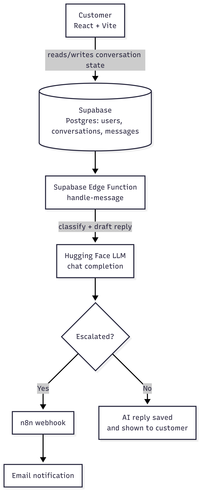

# Support Desk AI - Customer Support AI Assistant with Human Handoff

This is my submission for the technical challenge. It's a small support
system: a customer sends a message, an AI tries to classify it and answer it
if it can, and if it can't (or shouldn't), the conversation gets escalated
to a human and someone gets notified automatically.

## System Architecture



The main thing I wanted to get right architecturally: the frontend never
decides anything important. It doesn't classify, it doesn't decide if
something's urgent, it just shows whatever state is in the database. All
of that logic lives in the Edge Function, because letting the client decide
"is this urgent" felt like the wrong trust boundary the moment I thought
about it (a customer's browser deciding whether it needs a human is... not
great). So the Edge Function is really the whole brain of this thing.

I also debated doing classification and the reply as two separate LLM
calls, but landed on one call that returns both in a single JSON response.
Mostly for latency/cost, but also because it meant I only had one place to
validate "did the AI actually give me something usable" instead of two.

## Tech Stack Used

- **Frontend:** React + Vite + Tailwind
- **Backend/DB:** Supabase (Postgres, RLS, Edge Functions)
- **AI:** Hugging Face Inference (chat completions)
- **Automation:** n8n Cloud ➡️ webhook ➡️ email
- **Edge Functions run on Deno**, which I hadn't used before this (see my
  Q1 answer, this tripped me up at first)

## Database

Three tables, migration is in `supabase/migrations/0001_init.sql`:

- `users` - just the demo users (see assumptions, I didn't build real auth)
- `conversations` - one row per support thread. Has `status`, `classification`,
  `escalation_reason`, and `escalation_notified`
- `messages` - each message, tagged `customer` / `ai` / `system`

I put classification and escalation status on the `conversations` table
rather than on individual messages. My reasoning: you escalate a whole
conversation, not one message in isolation, and the AI just re-classifies
the thread as it goes rather than me needing a history of every past
classification.

## Running it locally

### Frontend

```bash
cd frontend
npm install
cp .env.example .env
# fill in VITE_SUPABASE_URL and VITE_SUPABASE_ANON_KEY
npm run dev
```

### Supabase

1. Create a project on supabase.com.
2. Paste `supabase/migrations/0001_init.sql` into the SQL Editor and run it.
   This creates the tables and seeds the 4 demo users.
3. Grab your Project URL + anon/publishable key for the frontend `.env`.

### Edge Function

You need the Supabase CLI for this part.

```bash
supabase login
supabase link --project-ref YOUR_PROJECT_ID
supabase secrets set HF_API_KEY=your_hugging_face_token
supabase secrets set N8N_WEBHOOK_URL=your_n8n_production_webhook_url
supabase functions deploy handle-message
```

### n8n

Import `n8n/escalation-workflow.json`. It's just a Webhook node ➡️ Send Email
node. You'll need to add your own SMTP creds to the email node. Also and
this got me for a bit you have to actually click **Publish/Activate** on
the workflow, otherwise the production webhook URL just 404s. The test URL
works fine while you're sitting in the editor, which had me confused for a
while about why "it worked in my test but not for real."

## How I handled the reliability requirements

- **LLM call fails or times out:** wrapped in a 15s timeout + try/catch. If
  it fails for any reason, I don't leave the customer hanging, it
  auto-escalates with a reason saying the AI classification failed, instead
  of showing an error or nothing at all.
- **AI returns garbage/invalid output:** I ask the model for strict JSON,
  but I don't just trust that blindly, I pull out the first `{...}` block
  and check the classification is actually one of the 4 allowed values and
  the required fields are there. If any of that fails, same fallback as
  above: escalate rather than guess.
- **Duplicate escalation events:** there's an `escalation_notified` column
  on the conversation. Before firing the n8n webhook, the function checks
  it's still `false`. It only gets flipped to `true` after the webhook call
  actually succeeds, so if something retries the same escalation, it won't
  send a second email. If the webhook call itself fails, I leave the flag
  `false` so a retry could still notify someone, rather than that failure
  just disappearing silently.

## Assumptions I made (and why)

- **No real authentication.** There's a dropdown of 4 fake demo users
  instead of actual login. I made this call on purpose the challenge is
  clearly weighted toward the AI/escalation/reliability side of things, and
  I'd rather spend the limited time there than on an auth flow that doesn't
  really demonstrate anything specific to this problem.
- **RLS is on, but the policies are wide open.** This one I want to be
  upfront about rather than hope nobody notices: since there's no real auth,
  there's no `auth.uid()` to scope policies to, so right now anyone with the
  anon key can read/write these tables. That's obviously not fine for a real
  product it's a direct consequence of the fake-auth shortcut above, and
  I'd fix it together with real auth if this went further.
- **The knowledge base is just hardcoded text in the Edge Function prompt.**
  Fine for 4 demo topics, but a real support team would need to edit this
  without me redeploying code every time.
- **One open conversation per user at a time.** Didn't build support for
  multiple concurrent threads per customer.

## What I'd do with another week

- Actually build real auth (Supabase Auth) and lock down RLS properly
  this is the thing I'm least happy leaving as-is.
- Move the knowledge base into a table instead of a hardcoded prompt string,
  and probably do real retrieval instead of stuffing everything into the
  prompt every time.
- Build something for the *human* side of the handoff, right now the
  "escalation" just sends an email and stops. There's no actual agent view
  where a human reads the conversation and responds. That's a pretty big
  gap if I'm honest.
- Stream the AI's response instead of one round-trip request.
- Write actual tests for the validation logic in the Edge Function
  (malformed JSON, missing fields, bad classification values) instead of
  just manually testing it by sending messages and watching what happened.
- Some basic rate limiting on the Edge Function right now nothing stops
  someone from spamming it.
